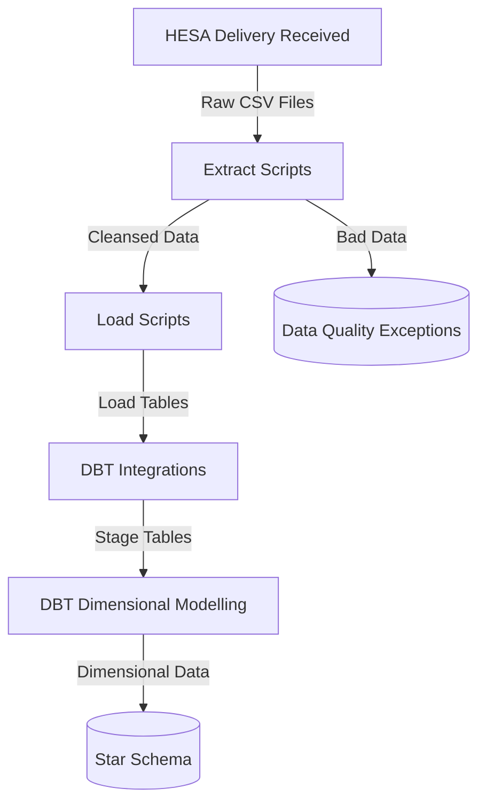

# Architecture Overview
This document describes the architecture of the HESA data warehouse, including its ETL pipeline, database structure, code organisation and config management. It also explains design decisions that shaped the implementation.


<div style="margin: 2em 0; min-height: 20px;"></div>


## Sections
- [Pipeline Diagram](#pipeline-diagram)
- [Scripts](#scripts)
- [Orchestration](#orchestration)
- [Data Quality](#data-quality)
- [Config Management](#config-management)
- [Docker Containerisation](#docker-containerisation)
- [Error Handling](#error-handling)
- [Logging](#logging)
- [Design Decisions](#design-decisions)


<div style="margin: 2em 0; min-height: 20px;"></div>


## Containerisation Strategy

This project implements a container-first architecture where all execution occurs within Docker containers rather than directly on host machines. Key aspects include:

- Service isolation through dedicated containers (ETL, MySQL)
- Inter-service communication via Docker network (app→mysql via internal hostnames)
- Code/data provided to ETL container via volume mounts
- Development workflow optimized for container execution

This approach ensures consistent execution and eliminates configuration issues across multiple host machines.


<div style="margin: 2em 0; min-height: 20px;"></div>


## Pipeline Diagram

<style> .mermaid { width: 50%; margin: 0 auto; } </style>


<div style="margin: 2em 0; min-height: 20px;"></div>


## Script Architecture
The codebase incorporates Python scripts and DBT models.

- **Core Classes**:
  - `TableCopier`: Copies data from one table to another
  - `CsvTableCopier`: Copies data from a CSV file to a table
  - Both implement batching/chunk-based processing for memory efficiency
  - Note: `TableCopier.py` currently unused as staging onwards now handled by DBT

- **Python Scripts**:
  - Extract Scripts: Process CSV files into cleansed format with data validation
  - Load Scripts: Move cleansed data into database tables using copier classes
  - Delivery Code: Scripts take 'delivery code' argument to enable multiple deliveries to be ingested
  - Look-up name: Generic look-up table loader takes 'look-up name' argument

- **Parameterised Execution**:
  - Orchestration: `hesa_nn056_pipeline.py` manages execution order and dependencies
  - Delivery Codes: Hard-coded in orchestration script, for each delivery to be ingested
  - Look-up table names: Hard-coded in orchestration script for each look-up table to be ingested 
  - Phase dependencies: Extract/load/stage/dim/fact phases are each dependent on preceding phase

<div style="margin: 1em 0; min-height: 20px;"></div>


## Orchestration
- Script `hesa_nn056_pipeline.py` handles pipelines execution order and dependencies.
- Pipeline has several phases: extract, load, stage, dimensions and facts
- Each phase is dependent on prior phase success

<div style="margin: 1em 0; min-height: 20px;"></div>


## Data Quality
Data quality filtering occurs in the extract scripts. Records are validated and output to either a 'transformed' or 'bad data' file.

- **Validation During Extraction**:
  - Format checks (e.g., email format, dates)
  - Missing or incomplete checks (mandatory values)
  - Format verification

- **Data Quality Filtering**:
  - Invalid records are diverted to "bad data" files
  - Reasons for "bad data" are appended in the bad data files

- **Resolving Data Issues**
  - Bad data may be re-issued by HESA or fixed by Warehouse team if expedient
  - Data corrected by HESA should be provided in completely new 'Delivery'
  - Simple data corrections done locally can be reloaded by re-running pipeline

This approach provides detailed data quality information for remediation, and improves stability by quarantining the bad data.


<div style="margin: 1em 0; min-height: 20px;"></div>


## Directory Structure for Data and Logs
Data and log directories are located within a `_mounts` directory in the project. This allows a small, test dataset to be bundled in the repo. These can be mapped via `docker-compose.yml` to other locations. 
```
<data_thru>/
├── _mounts/
│   ├── data/
│   │   ├── deliveries/
│   │   │   ├── 22056_20240331/
│   │   │   │   ├── hesa_22056_20240331_data_students.csv
│   │   │   │   ├── hesa_22056_20240331_data_demographics.csv
│   │   │   │   ├── hesa_22056_20240331_data_student_programs.csv
│   │   │   │   ├── hesa_22056_20240331_lookup_ETHNICITY.csv
│   │   │   │   └── ... (other lookup files)
│   │   │   │
│   │   │   └── 23056_20250331/
│   │   │       ├── hesa_23056_20250331_data_students.csv
│   │   │       ├── hesa_23056_20250331_data_demographics.csv
│   │   │       ├── hesa_23056_20250331_data_student_programs.csv
│   │   │       └── ... (lookup files)
│   │   │
│   │   ├── transformed/
│   │   │   ├── 22056_20240331/
│   │   │   │   ├── hesa_22056_20240331_students_transformed.csv
│   │   │   │   ├── hesa_22056_20240331_demographics_transformed.csv
│   │   │   │   └── hesa_22056_20240331_student_programs_transformed.csv
│   │   │   │
│   │   │   └── 23056_20250331/
│   │   │       └── ... (transformed files)
│   │   │
│   │   ├── mappings/
│   │   │   ├── lookup_mappings_ethnicity.csv
│   │   │   └── ... (other mapping files)
│   │   │
│   │   └── bad_data/
│   │       ├── 22056_20240331/
│   │       │   ├── hesa_22056_20240331_students_bad_data.csv
│   │       │   ├── hesa_22056_20240331_demographics_bad_data.csv
│   │       │   └── hesa_22056_20240331_student_programs_bad_data.csv
│   │       │
│   │       └── 23056_20250331/
│   │           └── ... (bad data files)
│   └── log/
│       ├── test/
│       │   ├── etl_info.log
│       │   └── etl_error.log
│       └── prod/
│           ├── etl_info.log
│           └── etl_error.log
```

<div style="margin: 1em 0; min-height: 20px;"></div>


## Config Management
- **Environment Variables**
  - Stored in `.env` file for host execution
  - Stored in `docker-compose.yml` for containerised execution
  - Contain DB credentials
  - `CONFIG_FILE`: Filepath for main config file

- **Main Config File**:
  - Typically named `config.json`, `test_config.json` or similar
  - Holds nested directory structure for CSV data, logs, DBT models, etc

- **Loading Config**:
  - Function `get_config()` in `data_platform_core.py` handles config loading
  - It attempts to load `.env` into environment variables (if file not found, env variables should have been set up directly in `docker-compose.yml`)
  - Main config file, which is loaded into dictionary `config`

This approach enables:
- Standard config across the codebase
- Different MySQL DB and CSV directories per environment (dev, test, live)
- Containerised or direct execution in host system.


<div style="margin: 1em 0; min-height: 20px;"></div>


## Docker Containerisation

- **Multi-Container Structure**:
  - MySQL container for database storage
  - Application container for ETL pipeline execution
  - Containers communicate via Docker Compose network

- **Docker Volume Mapping**:
  - MySQL data directory mapped to host for persistence
  - Pipeline data directories mapped for flexibility
  - Log directories mapped to host for easier debugging
  - DBT profiles mounted for consistent database connection

- **Configuration**:
  - Main ETL configuration is stored in `config.json` file
  - Database connection and ETL config file location are specified in `.env`
  - `.env` config is loaded by `docker-compose.yml` during build 
  - Data, log and source code directories are mounted via `docker-compose.yml`

This approach enables consistent deployment while maintaining flexibility for local development.


<div style="margin: 1em 0; min-height: 20px;"></div>


## Error Handling
Errors are mitigated, isolated and reported as follows:

- **Transaction Management**:
  - Python scripts use commit/rollback logic on success/error

- **Retry Logic**:
  - Database connections include retry logic, mainly to handle container spin-up for MySQL
  - Configurable retry parameters in `connect_to_db()` function

- **Error Isolation**:
  - Data quality issues are quarantined rather than stopping the pipeline
  - Major pipeline phases execute sequentially with dependency checks
  - Scripts inside each pipeline phase can run independently of each other
  - Enables consistent deployments across environments

- **Pipeline Logging**:
  - Pipeline progress (script names, row counts) logged to persistent logfile
  - Pipeline errors (exceptions and unrecoverable errors) are logged to a separate error log

- **Restartable**:
  - Processes are re-runnable without having to re-run prior dependencies
  - Scripts contain no special 'restart from' logic, always processing entire dataset


<div style="margin: 1em 0; min-height: 20px;"></div>


## Logging
The system uses a structured logging approach implemented through `data_platform_core.py`:

- **Log Configuration**:
  - `set_up_logging()` function configures logging for each script
  - Log levels are configurable through configuration files

- **Log Destinations**:
  - Log files (Python script progress/errors)
  - Console output (DBT progress/errors)
  - Container logs captured by Docker

- **Log Content**:
  - Pipeline progress
  - File names, table names and row counts
  - Performance metrics (execution time, row counts)
  - Error details with context
  - Data quality statistics


<div style="margin: 1em 0; min-height: 20px;"></div>


## Design Decisions
### Technology Choices
- **Python for extraction**: Provides flexibility for complex field-level transformations and validation
- **MySQL for database**: Chosen for balance of simplicity and functionality in a demonstration project
- **DBT for transformations**: Enables SQL-based transformation with version control and testing
- **Docker for deployment**: Ensures consistent environment across development and deployment

### Architectural Patterns
- **ETL vs ELT**: In practice not always possible or desirable to separate extract and transform logic, some transformation occurs in extract scripts
- **Field-level transformations in extract phase**: Name parsing happens during extraction for efficiency
- **Parameterised scripts**: All extract and load scripts take a 'delivery code' argument, so that multiple datasets can be processed without new scripts
- **Separation of concerns**: Distinct phases of orchestration make codebase/problem resolution easier to reason about

### Data Quality Management
- **Format validation**: Data validated during initial extract phase
- **Data quarantine**: Bad data removed and reportable, preventing pipeline execution errors
- **Bad data handling**: Invalid records are captured with reason codes for analysis
- **Testing strategy**: Automated testing at both load and stage levels

### General Implementation Decisions
- **Human-readable dimension keys**: Composite surrogate keys (e.g., `ETH_10_22056_20240331`) encode entity type, business key and delivery code. Makes keys easier to understand during troubleshooting. Also makes dimensional model resilient to dimensions being rebuilt without breaking foreign key references.
- **Isolated pipeline phases**: Each pipeline phase (extract, load, stage, etc) runs in separate scripts rather than having fewer, more comprehensive scripts. This makes the codebase easier to reason about.
- **Permanent tables**: Each pipeline phase writes to permanent tables rather than using views or CTEs. This supports troubleshooting, mid-pipeline restarts, and simpler scripts.


<div style="margin: 3em 0 1em 0; border-top: 1px solid #ccc; padding-top: 1em;">
  <strong>Navigation:</strong>
  <a href="README.md">Home</a> |
  <a href="architecture.md">Architecture</a> |
  <a href="container-first.md">Container First</a> |
  <a href="data-deliveries.md">HESA Deliveries</a> |
  <a href="data-model.md">Data Model</a> |
  <a href="getting-started.md">Getting Started</a> |
  <a href="hesa-data-info.md">HESA Data Info</a> |
  <a href="pipeline-process.md">Pipeline Process</a> |
  <a href="scripts.md">Scripts</a>
</div>