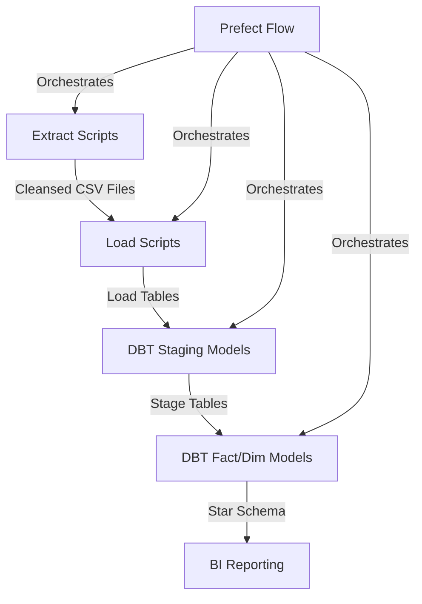

# Architecture Overview
This document explains the overall technical architecture of the pipeline.

## Pipeline Components

```mermaid
graph TD
    A[Extract Scripts] -->|Cleansed CSV Files| B[Load Scripts]
    B -->|Load Tables| C[DBT Staging Models]
    C -->|Stage Tables| D[DBT Fact/Dim Models]
    D -->|Star Schema| E[BI Reporting]
    G[Prefect Flow] -->|Orchestrates| A
    G -->|Orchestrates| B
    G -->|Orchestrates| C
    G -->|Orchestrates| D
```

