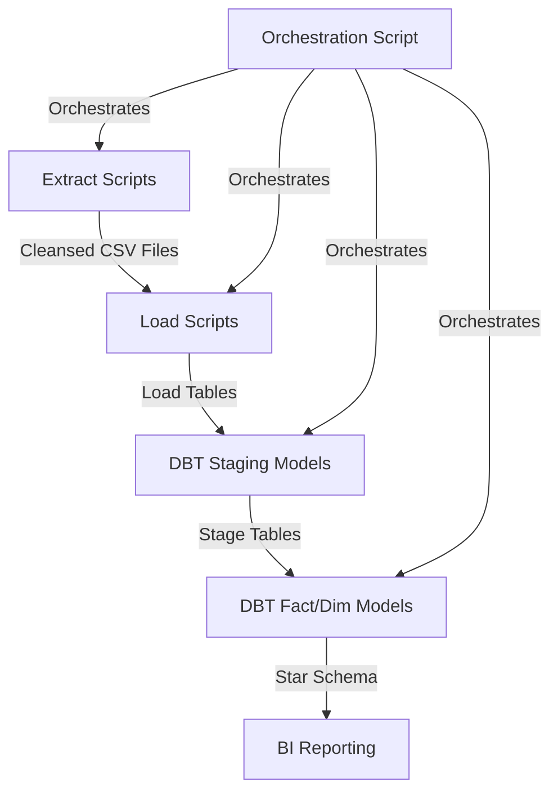

# Architecture Overview
This document describes the architecture of the HESA data warehouse, including its ETL pipeline, database structure, and supporting components. It explains their interactions and the design decisions that shaped the implementation.

## Pipeline Components

## Scripts
### hesa_nn056_pipeline.py
Orchestration script. Manages execution order and dependencies within main pipeline.
Manages parameterised execution of ELT scripts for multiple deliveries, look-up tables, etc.

### extract_hesa_nn056_students
Performs simple, column-level transformations and numerous data quality filters. Script is parameterised by delivery code.

### extract_hesa_nn056_demographics
Processes demographic data for student. Validates for expected column names and missing values.

### extract_hesa_nn056_student_programs
Processes student program enrolments, handling validation, data cleansing, and field-level transformations. Parameterized by delivery code.

## Orchestration
- Script `hesa_nn056_pipeline.py` handles pipelines execution order and dependencies.

## Data Quality
Data quality is managed through a multi-stage approach:

- **Extraction Phase Validation**:
  - Field-level validation (e.g., email format, date validation)
  - Missing data detection
  - Data type enforcement
  - Format verification

- **Quality Error Handling**:
  - Invalid records diverted to "bad data" files
  - Specific error reasons captured for each record
  - Error statistics logged and reported

- **Testing**:
  - Load tables verified against source files
  - Stage tables verified against expected results
  - Data profiling to detect anomalies

The system prioritizes transparency by maintaining detailed information about validation failures for analysis and remediation.

## Config Management
Configuration is centralized through the `data_platform_core.py` utility module, which provides consistent configuration access across all components.

- **Configuration Sources**:
  - `test_config.json`: Contains environment-specific settings including file paths and database parameters
  - `.env`: Environment variables for sensitive data like database credentials
  - Docker environment variables: Override settings in containerized deployments

- **Configuration Loading**:
  - `get_config()` function loads and merges configuration from all sources
  - Environment variables take precedence over JSON config
  - Container environment variables override local settings

This approach enables consistent configuration while supporting different deployment contexts (development, testing, containerized).

## Docker Containerisation
The system is containerized using Docker to ensure consistent deployment across environments:

- **Multi-Container Structure**:
  - MySQL container for database storage
  - Application container for pipeline execution

- **Volume Mapping**:
  - Data directories mapped to host for persistence across container restarts
  - Log directories mounted to facilitate debugging
  - DBT profiles directory mounted to provide database connection information

- **Environment Configuration**:
  - Database connection parameters passed through environment variables
  - Application configuration controlled via mounted config files
  - Directory locations standardized inside the container

This containerization strategy enables reproducible deployments while maintaining flexibility for local development.

## Error Handling
The architecture incorporates robust error handling to maintain system reliability:

- **Transaction Management**:
  - Database operations wrapped in transactions to prevent partial updates
  - Atomic operations where appropriate

- **Retry Logic**:
  - Database connections include retry logic with exponential backoff
  - Configurable retry parameters in `connect_to_db()` function

- **Error Isolation**:
  - Pipeline phases isolated to prevent cascading failures
  - Script execution continues where possible after non-critical errors

- **Comprehensive Logging**:
  - Exception details captured with tracebacks
  - Error context preserved for debugging
  - Execution steps logged for audit purposes

## Logging
The system uses a structured logging approach implemented through `data_platform_core.py`:

- **Log Configuration**:
  - `set_up_logging()` function configures logging for each script
  - Log level configurable through configuration files
  - Log rotation to prevent excessive file sizes

- **Log Destinations**:
  - File logging for permanent record
  - Console output for interactive monitoring
  - Container logs captured by Docker logging driver

- **Log Content**:
  - Execution progress and milestones
  - Performance metrics (execution time, row counts)
  - Error details with context
  - Data quality statistics

This logging strategy supports both operational monitoring and post-execution analysis.

## Design Decisions
### Technology Choices
- **Python for extraction**: Provides flexibility for complex field-level transformations and validation
- **MySQL for database**: Chosen for balance of simplicity and functionality in a demonstration project
- **DBT for transformations**: Enables SQL-based transformation with version control and testing
- **Docker for deployment**: Ensures consistent environment across development and deployment

### Architectural Patterns
- **ELT approach**: Data is loaded into MySQL before major transformations are applied via DBT
- **Field-level transformations in extract phase**: Name parsing happens during extraction for efficiency
- **Multi-delivery support**: Architecture designed to handle multiple data deliveries with consistent patterns
- **Separation of concerns**: Clear boundaries between extraction, loading, staging, and dimensional modeling

### Data Quality Management
- **Automated validation**: Input data validation occurs during extract phase
- **Bad data handling**: Invalid records are captured with reason codes for analysis
- **Testing strategy**: Automated testing at both load and stage levels

### Error Handling & Resilience
- **Component isolation**: Each pipeline phase operates independently, allowing for partial runs
- **Explicit dependency management**: Orchestration script enforces proper sequencing
