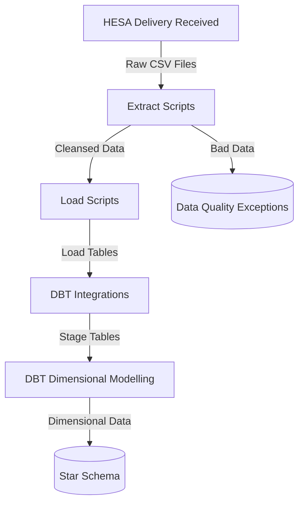

# Architecture Overview
This document describes the architecture of the HESA data warehouse, including its ETL pipeline, database structure, code organisation and config management. It also explains design decisions that shaped the implementation.

## Contents
- [Pipeline Diagram](#pipeline-diagram)
- [Scripts](#scripts)
- [Orchestration](#orchestration)
- [Data Quality](#data-quality)
- [Config Management](#config-management)
- [Docker Containerisation](#docker-containerisation)
- [Error Handling](#error-handling)
- [Logging](#logging)
- [Design Decisions](#design-decisions)

## Pipeline Diagram

## Script Architecture
The codebase incorporates Python scripts and DBT models with custom SQL for

- **Core Classes**:
  - `TableCopier`: Handles table-to-table data movement with transaction management
  - `CsvTableCopier`: Extends base copier functionality for CSV-to-table operations
  - Both implement batching/chunk-based processing for memory efficiency

- **Script Organization**:
  - Parameterized execution: All scripts accept delivery codes as command-line arguments
  - Consistent error handling: Try/except blocks with standardized logging
  - Configuration isolation: Scripts retrieve settings from centralized config module

- **Execution Patterns**:
  - Extract scripts: Process CSV files into cleansed format with data validation
  - Load scripts: Move cleansed data into database tables using copier classes
  - Orchestration: Manages execution order with phase-level dependency checks

## Orchestration
- Script `hesa_nn056_pipeline.py` handles pipelines execution order and dependencies.
- Pipeline has several phases: extract, load, stage, dimensions and facts
- Each phase is dependent on prior phase success

## Data Quality
Data quality filtering occurs in the extract scripts. Records are validated and output to either a 'transformed' or 'bad data' file.

- **Validation During Extraction**:
  - Format checks (e.g., email format, dates)
  - Missing or incomplete checks (mandatory values)
  - Format verification

- **Data Quality Filtering**:
  - Invalid records are diverted to "bad data" files
  - Reasons for "bad data" are appended in the bad data files

- **Re-runnable**
  - Data quarantined due to data quality may need to be remedied and reloaded
  - Data corrected by HESA should be provided in completely new 'Delivery'
  - Simple data corrections done locally can be reloaded by re-running pipeline

This approach provides detailed data quality information for remediation, and improves stability by quarantining the bad data.

## Config Management

- **Environment Variables**
  - Hold DB credentials and filepath for main config file
  - Stored in `.env` file for host execution
  - Stored in `docker-compose.yml` for containerised execution

- **Main Config File**:
  - Typically named `config.json`, `test_config.json` or similar
  - Holds nested directory structure for CSV data, logs, DBT models, etc

- **Loading Config**:
  - Function `get_config()` in `data_platform_core.py` handles config loading
  - It attempts to load `.env` into environment variables (if file not found, env variables should have been set up directly in `docker-compose.yml`)
  - Main config file, which is loaded into dictionary `config`

This approach enables:
  - Standard config across the codebase
  - Different MySQL DB and CSV directories per environment (dev, test, live)
  - Containerised or direct execution in host system.

## Docker Containerisation
The system is containerized using Docker to ensure consistent deployment across environments:

- **Multi-Container Structure**:
  - MySQL container for database storage
  - Application container for pipeline execution

- **Volume Mapping**:
  - Data directories mapped to host for persistence across container restarts
  - Log directories mounted to facilitate debugging
  - DBT profiles directory mounted to provide database connection information

- **Environment Configuration**:
  - Database connection parameters passed through environment variables
  - Application configuration controlled via mounted config files
  - Directory locations standardized inside the container

This containerization strategy enables reproducible deployments while maintaining flexibility for local development.

## Error Handling
The architecture incorporates robust error handling to maintain system reliability:

- **Transaction Management**:
  - Python scripts use commit/rollback logic on success/error
  - After errors, processes are restarted without any 'restart from' logic

- **Retry Logic**:
  - Database connections include retry logic, mainly to handle container spin-up for MySQL
  - Configurable retry parameters in `connect_to_db()` function

- **Error Isolation**:
  - Data quality issues are quarantined rather than stopping the pipeline
  - Major pipeline phases execute sequentially with dependency checks
  - Scripts inside each pipeline phase can run independently of each other
  - This approach provides better oversight of errors than failing at the first error

- **Pipeline Logging**:
  - Pipeline progress (script names, row counts) logged to persistent logfile
  - Pipeline errors (exceptions and unrecoverable errors) are logged to a separate error log

## Logging
The system uses a structured logging approach implemented through `data_platform_core.py`:

- **Log Configuration**:
  - `set_up_logging()` function configures logging for each script
  - Log level configurable through configuration files
  - Log rotation to prevent excessive file sizes

- **Log Destinations**:
  - File logging for permanent record
  - Console output for interactive monitoring
  - Container logs captured by Docker logging driver

- **Log Content**:
  - Execution progress and milestones
  - Performance metrics (execution time, row counts)
  - Error details with context
  - Data quality statistics

This logging strategy supports both operational monitoring and post-execution analysis.

## Design Decisions
### Technology Choices
- **Python for extraction**: Provides flexibility for complex field-level transformations and validation
- **MySQL for database**: Chosen for balance of simplicity and functionality in a demonstration project
- **DBT for transformations**: Enables SQL-based transformation with version control and testing
- **Docker for deployment**: Ensures consistent environment across development and deployment

### Architectural Patterns
- **ELT approach**: Data is loaded into MySQL before major transformations are applied via DBT
- **Field-level transformations in extract phase**: Name parsing happens during extraction for efficiency
- **Multi-delivery support**: Architecture designed to handle multiple data deliveries with consistent patterns
- **Separation of concerns**: Clear boundaries between extraction, loading, staging, and dimensional modeling

### Data Quality Management
- **Automated validation**: Input data validation occurs during extract phase
- **Bad data handling**: Invalid records are captured with reason codes for analysis
- **Testing strategy**: Automated testing at both load and stage levels

### Error Handling & Resilience
- **Component isolation**: Each pipeline phase operates independently, allowing for partial runs
- **Explicit dependency management**: Orchestration script enforces proper sequencing

  <strong>Navigation:</strong>
  <a href="architecture.md">Architecture</a> |
  <a href="data-deliveries.md">HESA Deliveries</a> |
  <a href="data-model.md">Data Model</a> |
  <a href="pipeline-process.md">Pipeline Process</a> |
  <a href="scripts.md">Scripts</a> |
  <a href="daily.md">Development Journal</a>

