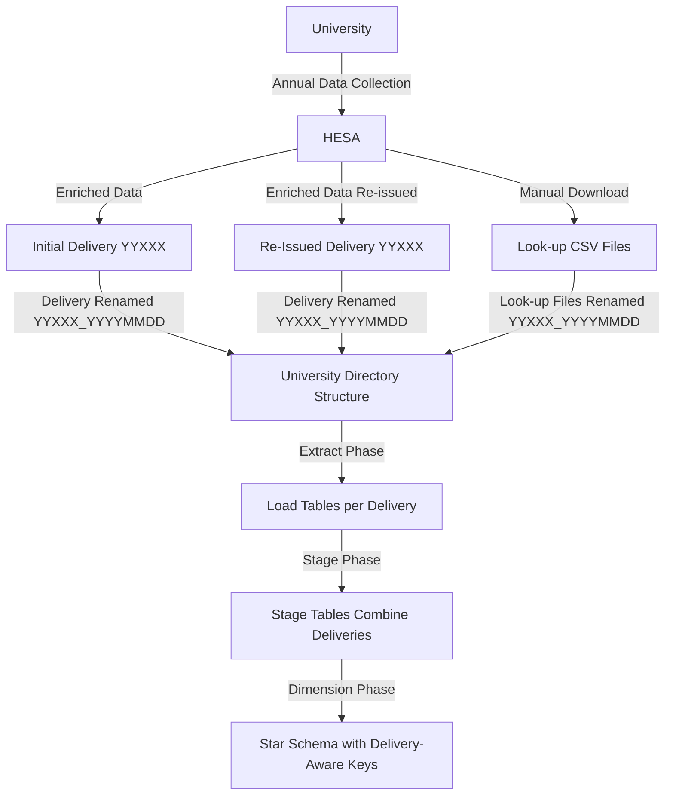

# HESA Deliveries
This document explains the concept of 'HESA Deliveries' and how it is implemented in the HESA Student data pipeline.

## Contents
- [Background](#background)
- [Concepts](#concepts)
- [HESA Delivery Identifier](#hesa-delivery-identifier)
- [Delivery Data Flow Diagram](#delivery-data-flow-diagram)
- [Implementation in the Data Model](#implementation-in-the-data-model)
- [Receiving a new Delivery from HESA](#receiving-a-new-delivery-from-hesa)
- [Multi-Delivery Advantages](#multi-delivery-advantages)

## Background
Universities send an annual student data 'collection' to HESA. It contains academic activity, outcomes and personal information.

HESA enriches the data with statistical data and 'delivers' an enriched dataset back to each institution for data analysis. HESA may issue revisions of the same 'delivery'.

## Concepts
### Data Collections
- Each year, HESA 'collects' student data from all UK universities
- These can be identified by the academic year of the data (e.g. '22' means 202223 data)
- These are currently annual but may in future become intra-year

### HESA Schemas
- Prior to 2022, HESA used an arbitrary CSV file layouts
- In 2022 HESA published a stable schema called 'Data Futures' that should remain stable for consecutive years
- Stable schema '056' is for 2022 onwards, schema '057' will be used from 2028

### CSV Deliveries
- HESA enriches collected data and returns it to each university a set of CSV files
- HESA may deliver revised versions of a dataset if errors occurred
- Every initial/revised data delivery should be preserved in the warehouse

## HESA Delivery Identifier
Each delivery is identified by a unique code in the format `YYXXX_YYYYMMDD`:
- `YY` : academic year of original data ('22' for 2022/23)
- `XXX` : HESA schema used ('056' for student collections 2022-2026)
- `YYYYMMDD` : date the enriched data was delivered

 

For example:
- `22056_20240331`: March 2024 delivery for 2022-23 collection
- `23056_20250331`: March 2025 delivery for the 2023-24 collection

## CSV Directory Structure
Each data delivery has its own 'deliveries' sub-directory, and the data flow into 'transformed' or 'bad data' directories for further processing. Please see `architecture.md` for directory structure.

## Delivery Data Flow Diagram

## Delivery Code in the Data Model
The HESA delivery concept impacts various aspects of the data architecture and pipeline.

### Delivery Datasets
- Each year HESA collects data and delivers an enriched version
- Each delivery is linked to its original collection year (`collection_code` '22056', '23056', '24056', etc)
- The warehouse team manually assigns a `delivery_code` by adding date of receipt to the collection code (e.g. '22056_20240331')
- Each delivery has a separate sub-directory in `data/deliveries`

### Look-up Tables
- HESA CSV files contain additional, coded values such as ethnicity, religion codes
- Look-up tables per code are available on the HESA website
- Warehouse team must download those look-up tables and copy to same subdir as main CSV files

### How Delivery Code Affects Database Structure
- A set of load tables is created for every HESA delivery
- Load tables for multiple deliveries are merged into one stage table by UNION
- Load and stage tables have `hesa_delivery` column indicating the delivery id
- Each dimension table has a compound natural key including `hesa_delivery`

### Pipeline Processing
- Orchestration scripts ensure pipeline is executed for each HESA delivery
- Staging models combine deliveries using UNION operations
- Dimension models maintain delivery context in surrogate keys

### Data Access
- Queries can filter on specific deliveries or span multiple deliveries
- Reports can compare data across different deliveries

## Receiving a new Delivery from HESA
When new delivery is received:
- Create load tables via scripts like `create_hesa_23056_load_tables.py`
- Update staging models to UNION the new load tables
- Add extract/load steps to Prefect orchestrator

## Multi-Delivery Advantages
Embedding the delivery id in natural keys of the dimensional model provides:

1. **Historical Data Preservation**: All deliveries and revisions are retained
2. **Trend/Change Tracking**: Differences between deliveries can be analysed
3. **Version-Specific Reporting**: Reports can target specific deliveries
4. **Data Lineage**: Each record maintains its delivery context throughout the pipeline

  <strong>Navigation:</strong>
  <a href="README.md">Home</a> 
  <a href="architecture.md">Architecture</a> |
  <a href="data-deliveries.md">HESA Deliveries</a> |
  <a href="data-model.md">Data Model</a> |
  <a href="pipeline-process.md">Pipeline Process</a> |
  <a href="hesa-data-info.md">HESA Data Info</a> |
  <a href="scripts.md">Scripts</a>

