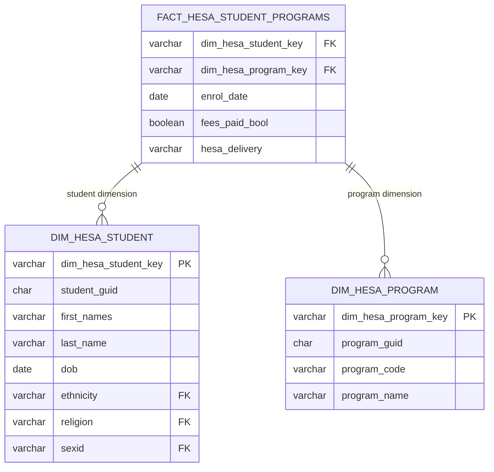

# Data Warehouse: Star Schema
The star schema design includes dimension and fact tables as visualised below. For detailed column descriptions and business rules, see the DBT YAML definitions in [`dbt/models/schema.yml`](../dbt/models/schema.yml).

Each dimension includes surrogate keys built with human-readable patterns:
`DIM_<type>_<code>_<delivery>` (e.g., `STU_12345_22056_20240331`)

## Delivery-Aware Dimensions
- Delivery Code uniquely identifies each tranche of CSV files received from HESA.
- It is a composite value incorporating the receipt date.
- It is stored in warehouse tables as column `hesa_delivery`
- This allows each student/program/ethnicity code/etc to have different data per delivery.
- Dimensions also contain the delivery code in their surrogate key

## Inter-Delivery Mappings
- Dimensions have delivery code as part of their PK.
- Delivery Code uniquely identifies each tranche of CSV files received from HESA.
- It is a composite value incorporating the receipt date.
- It is stored in warehouse tables as column `hesa_delivery`
- This allows each student/program/ethnicity code/etc to have different data per delivery.
- Dimensions also contain the delivery code in their surrogate key

## Star Schema ERD

  <strong>Navigation:</strong>
  <a href="README.md">Home</a> 
  <a href="architecture.md">Architecture</a> |
  <a href="data-deliveries.md">HESA Deliveries</a> |
  <a href="data-model.md">Data Model</a> |
  <a href="pipeline-process.md">Pipeline Process</a> |
  <a href="hesa-data-info.md">HESA Data Info</a> |
  <a href="scripts.md">Scripts</a>

