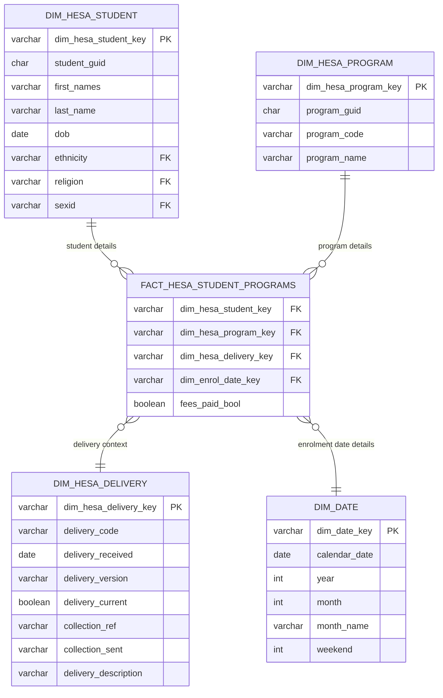

# Data Warehouse: Star Schema Design
This document outlines the star schema (dimensional data model) used for the HESA data warehouse. For information about load/stage tables please refer to <a href="pipeline-process.md">Pipeline Process</a>.

It should be noted that, whilst the dataset is a small subset of a typical university data warehouse, it is designed to demonstrate good practice in:
- ETL development
- handling time-based datasets
- dimensional modeling
- data wrangling for canonical keys

## Final Dimensional model
The final dimensional model consists of:
- **Main dimension tables** main business entities (students, programs)
- **Look-up dimensions** descriptive labels (e.g. demographic categories) including canonical keys for historical trend analysis
- **Fact tables** metrics (student program enrollments) to be analysis by dimensions

For detailed column descriptions and business rules, see the DBT YAML definitions in [`dbt/models/schema.yml`](../dbt/models/schema.yml).

## Compound dimension keys
Each dimension has a surrogate key with a human-readable pattern: `<dim_code>_<business_key>_<delivery>` (e.g., `PGM_<guid>_22056_20240331`)

This supports troubleshooting and also enables dimension rebuilds without breaking foreign key references.

## Delivery-Aware Dimensions
- Delivery Code uniquely identifies each tranche of CSV files received from HESA.
- It is a composite value incorporating the receipt date.
- It is stored in warehouse tables as column `hesa_delivery`
- Each student/program/ethnicity code/etc has discrete data per delivery.

## Inter-Delivery Canonical Mappings
- Look-up codes such as religion may vary between HESA deliveries due to wording changes.
- For example, old ethnicity code '101 (white british)' could be replaced with new '601 (british white)'.
- Report writers need to report on historical trends even when data is categorised with new/old values.
- This is handled using 'canonical keys' which define a common key (e.g. 101/601 may each have canonical key 601).
- Data analysts supply canonical mappings in a CSV file, some wrangling required by data engineer.
- The mappings are loaded into the required dimension as a 'canonical key'.

## Star Schema ERD

  <strong>Navigation:</strong>
  <a href="README.md">Home</a> |
  <a href="architecture.md">Architecture</a> |
  <a href="container-first.md">Container First</a> |
  <a href="data-deliveries.md">HESA Deliveries</a> |
  <a href="data-model.md">Data Model</a> |
  <a href="getting-started.md">Getting Started</a> |
  <a href="hesa-data-info.md">HESA Data Info</a> |
  <a href="pipeline-process.md">Pipeline Process</a> |
  <a href="scripts.md">Scripts</a>

