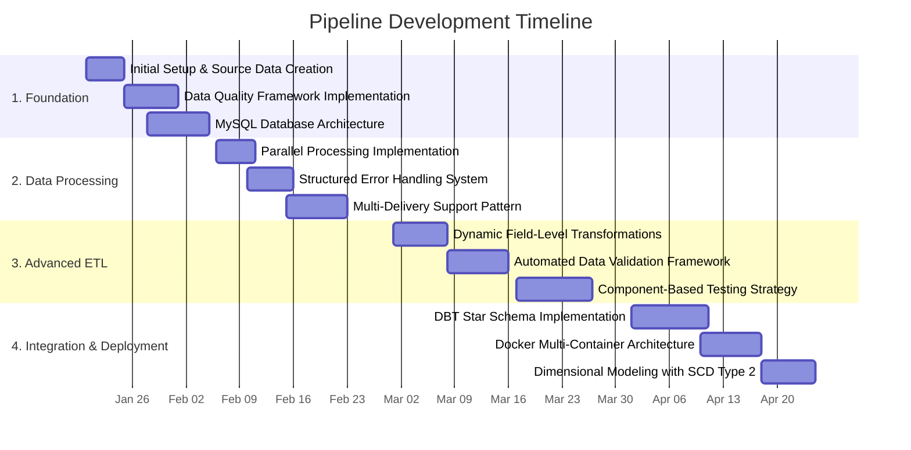

# Data Engineering Portfolio Project Journey

## Technical Evolution

### January 2025: Foundation & Core ETL Development
- Developed initial ETL pipeline with Python and Pandas
- Implemented data validation and good/bad results files
- Initial implementation of multi-delivery processing
- Transitioned from SQLite to MySQL for WSL compatibility and overall feature set

### February 2025: Performance & Integration
- Improved CSV validation using batching and parallel processing
- Built pipeline orchestration script
- Stage tables integrating multi-entity data (students, demographics, programs)
- Implemented structured error management with detailed reason tracking
- Refined pipeline for consistent handling of multiple deliveries

### March 2025: Architecture & Testing
- Implemented OOP principles for improved code organization
- Developed component-based testing strategy using "expected results" files
- Containerized database with Docker for consistent environment
- Improved database connection management with retry and consistent transaction handling

### April 2025: Advanced Features & Deployment
- Re-implemented stage tables with DBT
- Implemented dimensional modeling with DBT
- Created full Docker containerization with volume mapping 
- Developed documentation framework
- Added SCD Type 2 historical tracking for dimensions

# Key Learnings

## Python Data Engineering
- **Pandas Optimization**: Learned to handle chunked processing and type inference challenges
- **Parallelization**: Implemented multi-processing for transforms but discovered it wasn't beneficial for this I/O-bound workload

## Database Technologies
- **MySQL vs SQLite**: Transitioned from SQLite to MySQL to resolve WSL compatibility issues and general feature set
- **Connection Management**: Implemented retry logic and proper transaction handling

## Containerization
- **Docker Compose**: Configured multi-container setup with database and application containers
- **Volume Mapping**: Designed persistent storage strategy for containerized applications

## Testing & Quality
- **Component Testing**: Developed automated tests for extract, load, and transformation processes
- **Data Quality Management**: Implemented comprehensive validation and detailed error tracking

# Data Warehouse Project Journey

## Project Timeline

## Key Technical Implementations

### ETL Pipeline
- **Multi-Phase Processing**: Built an ELT pipeline with extract, load, and transform phases
- **Parallel Processing**: Used multiprocessing with batched validation to improve throughput
- **Error Handling**: Implemented validation with detailed error tracking for failed records
- **Multi-Delivery Support**: Created parameterized execution for multiple data deliveries

### Data Quality Management
- **Validation**: Added field-level checks for formats, data types, and relationships
- **Error Tracking**: Captured specific reasons for validation failures
- **Data Lineage**: Maintained delivery codes throughout the pipeline

### Database & Transformation
- **Dimensional Modeling**: Created star schema with SCD Type 2 historical tracking
- **DBT Layers**: Built transformation layers from raw to dimensional models
- **SQL Patterns**: Used UNION, JOIN, and DISTINCT operations for multiple deliveries

### System Architecture
- **Docker Containers**: Set up multi-container solution with volume mapping
- **Configuration**: Created centralized configuration system for different environments
- **Error Management**: Added connection retry logic and transaction handling

## Full Development Log
For a detailed account of this project's development journey, see daily.md.